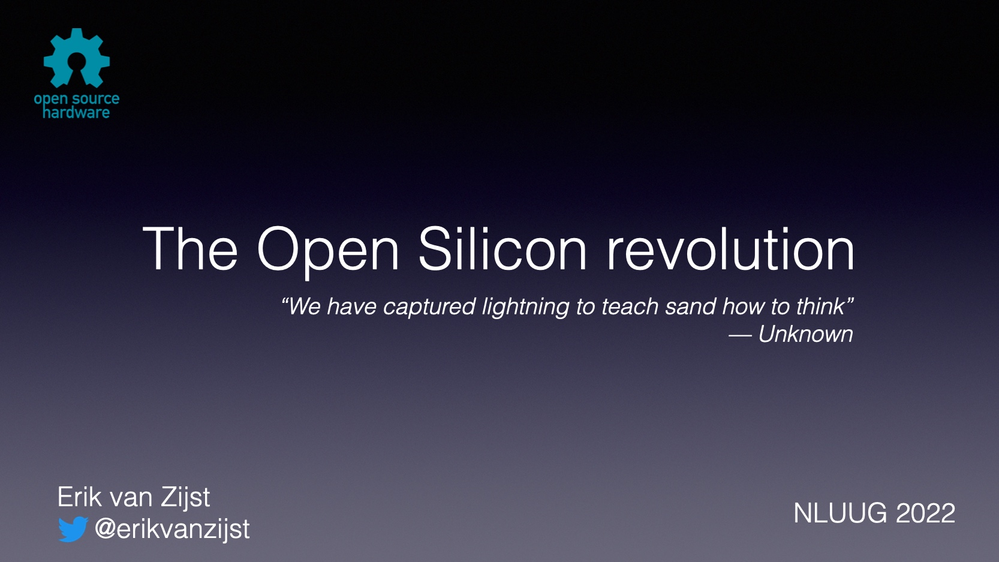



Resources accompanying my talk at [NLUUG 2022](https://www.nluug.nl/activiteiten/events/vj22/programma/index.html).

## HDL Tooling

* Verilog: Low-level hardware description level: [https://wikipedia.org/wiki/Verilog](https://wikipedia.org/wiki/Verilog)
* VHDL: Low-level hardware description level: [https://en.wikipedia.org/wiki/VHDL](https://en.wikipedia.org/wiki/VHDL)
* Amaranth (nMigen): Modern HDL based on Python: [https://github.com/amaranth-lang/amaranth](https://github.com/amaranth-lang/amaranth)
* Chisel: Modern HDL based on Scala: [https://www.chisel-lang.org/](https://www.chisel-lang.org/)
* SpinalHDL: Another modern HDL based on Scala: [https://spinalhdl.github.io/SpinalDoc-RTD/master/index.html](https://spinalhdl.github.io/SpinalDoc-RTD/master/index.html)
* LiteX: Python-based System on a Chip (SoC) designer: [https://github.com/enjoy-digital/litex](https://github.com/enjoy-digital/litex)

## ASICs

* Twitter thread on Pong ASIC project: [https://twitter.com/erikvanzijst/status/1388668730163359747](https://twitter.com/erikvanzijst/status/1388668730163359747)
* ZeroToAsic course: [https://www.zerotoasiccourse.com/](https://www.zerotoasiccourse.com/)
* @mattvenn's ASIC resources: [https://github.com/mattvenn/awesome-opensource-asic-resources](https://github.com/mattvenn/awesome-opensource-asic-resources)
* Google/SkyWater/eFabless [announcement on hackster.io](https://www.hackster.io/news/efabless-google-and-skywater-are-enabling-us-mere-mortal-makers-to-design-our-own-open-source-asics-28917eb5357a)
* Cadence Generic PDK: [https://community.cadence.com/cadence_blogs_8/b/breakfast-bytes/posts/generic-pdks](https://community.cadence.com/cadence_blogs_8/b/breakfast-bytes/posts/generic-pdks)
* Photolithography video by Zeiss: [https://www.youtube.com/watch?v=IMptIcviR0Y&t=0s](https://www.youtube.com/watch?v=IMptIcviR0Y&t=0s)
* [Sam Zeloof](http://sam.zeloof.xyz/) home IC manufacturing: [https://www.youtube.com/watch?v=23fTB3hG5cA](https://www.youtube.com/watch?v=23fTB3hG5cA)

## FPGAs

* Claire Wolf: RTL to iCE40: https://www.youtube.com/watch?v=SOn0g3k0FlE
* Precursor: open, FPGA-based "phone": https://www.crowdsupply.com/sutajio-kosagi/precursor
* SymbiFlow / F4PGA: end-to-end open source FPGA toolchain ("gcc for FPGAs"): https://f4pga.org/
* FABulous: an open FPGA fabric: https://fabulous.readthedocs.io/en/latest/
* SOFA (Skywater Opensource FpgA): open-source embedded FPGA IP library: https://skywater-openfpga.readthedocs.io/en/latest/device/introduction/
* FPGA vendors: Altera (Intel), Xilinx (AMD), Lattice, QuickLogic

## IP Cores

* Open source IP cores: https://opencores.org/projects
* Commercial IP core marketplace: https://www.design-reuse.com/
* CHIPS Alliance: Linux Foundation backed open source hardware components and tooling: https://chipsalliance.org/

## RISC-V

* RISC-V organisation: https://riscv.org/
* PicoRV32: Compact 32 bit RISC-V core: https://github.com/YosysHQ/picorv32
* https://www.eetasia.com/is-arms-inflexibility-its-downfall/
* https://en.wikipedia.org/wiki/Comparison_of_instruction_set_architectures#cite_note-30
* RISC-V in Google's HSM: https://www.golem.de/news/titan-m2-googles-security-chip-nutzt-risc-v-2110-160659.html

## Miscellaneous

* MNT Reform: Laptop with lots of open hardware: https://mntre.com/media/reform_md/2020-05-08-the-much-more-personal-computer.html
* Digital covid test: https://twitter.com/foone/status/1475228059867381761?lang=en
* SD card controllers: https://www.dpreview.com/forums/post/31459918
* Bunnie on LiteX vs Vivado: https://www.bunniestudios.com/blog/?p=5018
* Revolution OS: 2001 documentary on OSS & Linux: https://www.youtube.com/watch?v=J1bBG1NtL18

